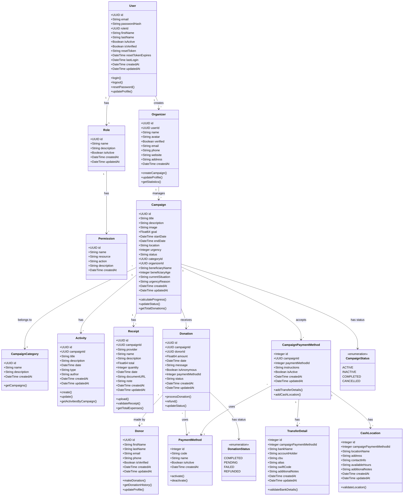

# Diagrama de Clases - Dona Tutti API

## Descripción General
Este diagrama representa la estructura de clases del sistema de donaciones "Dona Tutti", mostrando las entidades principales y sus relaciones.

## Diagrama de Clases

## Descripción de las Relaciones

### Relaciones Principales

1. **User - Role - Permission**: Sistema RBAC
   - Un usuario tiene un rol
   - Un rol tiene múltiples permisos

2. **User - Organizer**:
   - Un usuario puede crear múltiples organizadores
   - Un organizador pertenece a un usuario

3. **Organizer - Campaign**:
   - Un organizador puede gestionar múltiples campañas
   - Una campaña pertenece a un organizador

4. **Campaign - CampaignCategory**:
   - Una campaña pertenece a una categoría
   - Una categoría puede tener múltiples campañas

5. **Campaign - Activity**:
   - Una campaña puede tener múltiples actividades
   - Una actividad pertenece a una campaña

6. **Campaign - Receipt**:
   - Una campaña puede tener múltiples recibos/comprobantes
   - Un recibo pertenece a una campaña

7. **Campaign - Donation**:
   - Una campaña puede recibir múltiples donaciones
   - Una donación se hace a una campaña específica

8. **Donation - Donor**:
   - Un donador puede hacer múltiples donaciones
   - Una donación es hecha por un donador

9. **Donation - PaymentMethod**:
   - Una donación usa un método de pago
   - Un método de pago puede usarse en múltiples donaciones

10. **Campaign - CampaignPaymentMethod - PaymentMethod**:
    - Una campaña puede aceptar múltiples métodos de pago
    - La relación se gestiona a través de CampaignPaymentMethod

11. **CampaignPaymentMethod - TransferDetail/CashLocation**:
    - Un método de pago de campaña puede tener detalles de transferencia
    - Un método de pago de campaña puede tener ubicaciones para pago en efectivo

## Notas de Implementación

### Tipos de Datos
- **UUID**: Usado para IDs principales (User, Campaign, Donation, etc.)
- **Integer**: Usado para PaymentMethod y entidades relacionadas
- **Float64**: Usado para montos monetarios
- **DateTime**: Timestamps con createdAt/updatedAt automáticos
- **Boolean**: Flags de estado (isActive, isVerified, etc.)

### Patrones de Diseño
- **Repository Pattern**: Capa de acceso a datos
- **Service Layer**: Lógica de negocio
- **Clean Architecture**: Separación entre modelos de DB y entidades de dominio
- **DTO Pattern**: Objetos de transferencia para request/response

### Características Especiales
- **Soft Delete**: Manejo de eliminación lógica con flags de estado
- **Auditoría**: Campos createdAt/updatedAt automáticos
- **Validación**: Validaciones a nivel de modelo y servicio
- **Autorización**: Sistema RBAC integrado con JWT

## Flujos Principales

1. **Creación de Campaña**:
   User → Organizer → Campaign → CampaignPaymentMethod

2. **Proceso de Donación**:
   Donor → Donation → Campaign (con PaymentMethod)

3. **Gestión de Actividades**:
   Campaign → Activity (registro de eventos/actualizaciones)

4. **Control de Gastos**:
   Campaign → Receipt (comprobantes de gastos)

## Tecnologías Utilizadas
- **Framework**: Echo v4 (Go)
- **ORM**: GORM
- **Base de Datos**: PostgreSQL 15
- **Autenticación**: JWT
- **Documentación**: Swagger/OpenAPI